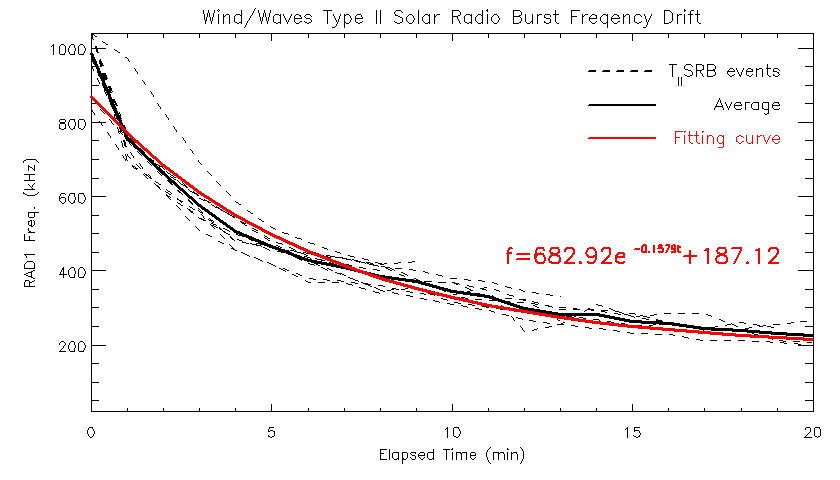

# Type_II_Solar_Radio_Bursts
## 專案介紹
本專案使用 IDL 程式語言，利用 Wind / WAVES 的 RAD1 及 RAD2 資料分析 2019 年 4 月第二型太陽無線電暴事件，並根據分析結果探討其頻漂特性。

## 專案技術
IDL 8.7

## 資料夾說明
* data - Wind 衛星資料放置處
* fig - 圖片放置處
  * dynamic_spec - 動態頻譜圖片
  * freq_drift - 頻漂擬合圖片
* report - 報告檔案放置處
  * progress - 進度報告
  * proposal - 計劃書報告
  * results - 結果報告  

## 實作
### 太陽無線電暴
太陽無線電暴(Solar Radio Burst)是一種在動態頻譜圖中隨時間變化的結構（如下圖），可分為第一至第五型太陽無線電暴 （Ganse et al. 2012），不同類型的太陽無線電暴在頻譜圖中所呈現的特性不太一樣，本次專題所研究的第二型太陽無線電暴，可看出其在動態頻譜圖中會隨時間由高頻漂移至低頻，且漂移速率相對於第三型太陽無線電暴緩慢，頻漂持續時間約 5 至 15 分鐘。通常認為第二型太陽無線電暴的形成與震波有關，諸如行星際震波　（Interplanetary Shock Wave） 或是日冕物質拋射誘發震波 （CME driven shock wave） 皆有可能引發第二型太陽無線電暴。  


### Wind 衛星
Wind 衛星於 1994 年 11 月 1 日發射，被用來研究太陽風和地球磁層中發生的無線電波和電漿。Wind 裝載 Wind Radio/Plasma Wave （WAVES） 可用來取得無線電波資料，分別有 RA1 （20 kHz – 1040 kHz）以及 RAD2 （1075 kHz – 13.825 MHz） 兩個波段可以接收訊號。我們從 [Coordinated Data Analysis Web (CDAWeb)](https://cdaweb.gsfc.nasa.gov/index.html) 網站中選定 Wind Radio/Plasma Wave, (WAVES) Hi-Res Parameters 資料格式，並在設定完需要的資料時間範圍後獲得檔名為 WI_H1_WAV_255982.dat 的 RAD1 及 RAD2 資料，並使用 [save_wind_radio.pro](./save_wind_radio.pro) 將 WI_H1_WAV_255982.dat 檔案依照其檔案格式轉存為 IDL 能夠存取的 .save 相關檔案。  
註：由於 Github 檔案上傳大小限制，本專案並未留存 WI_H1_WAV_255982.dat 檔案。

### 動態頻譜與頻漂分析
由於 Wind 衛星的資料解析力不足，我首先分別在時間變數、RAD1 與 RAD2 變數用 interpol 進行線性內插
``` IDL
nx = n_elements(t)
xp = findgen(nx)*(t[-1]-t[0])/(nx-1)+t[0]
xs =  interpol(findgen(nx),t,xp)

ny1 = n_elements(freq1)
y1p = findgen(ny1)*(y1max-y1min)/(ny1-1)+y1min
y1s =  interpol(findgen(ny1),freq1,y1p)

ny2 = n_elements(freq2)
y2p = findgen(ny2)*(y2max-y2min)/(ny2-1)+y2min
y2s =  interpol(findgen(ny2),freq2,y2p)
```
接著針對 RAD1 與時間還有 RAD2 與時間分別用 interpolate 做二維線性內插，再用 bytscl 將資料數值範圍轉換到 0 至 254
``` IDL
image1 = interpolate(y1,xs,y1s,missing=nan,/grid)
log_y1 = 10*alog10(image1)
scaled1 = bytscl(log_y1,min=RADmin,max=RADmax,top=254)

image2 = interpolate(y2,xs,y2s,missing=nan,/grid)
log_y2 = 10*alog10(image2)
scaled2 = bytscl(log_y2,min=RADmin,max=RADmax,top=254)
```
最後使用 plot、tvimage 與 colorbar 等指令即可繪製出動態頻譜圖。由於本次專題需要繪製多張頻譜圖，因此將以上流程包裝為 [dynamic_spec.pro](./dynamic_spec.pro) 方便繪製不同第二型無線電暴事件的動態頻譜圖。  

#### 範例
  
2019 年 4 月 2 日 15:45.30 - 16:09.30 UT 的第二型太陽無線電暴事件之動態頻譜圖。  
從上圖可看出第二型無線電暴主要的訊號是在 RAD1 的頻率範圍內，而在 RAD2 頻率範圍內則幾乎沒有反應，因此我們僅針對 RAD1 進行頻漂的分析。在頻譜圖中先標記事件的起始與結束時間，得到事件發生的時間範圍，在時間範圍內對每個時間點使用高斯函數擬合功率曲線，取其局部極大值即可得到此時間點的頻漂中心。使用 [plot_gaussian_fitting.pro](./plot_gaussian_fitting.pro) 繪製 2019 年 4 月 2 日 15:50.20 UT 之功率曲線高斯擬合圖  


### 成果
除了上述範例，我在 2019 年 4 月還發現其他 9 個第二型太陽無線電暴事件，並基於上述方法進行分析。我使用 [plot_dynamic_spec.pro](./plot_dynamic_spec.pro) 批次繪製不同事件的動態頻譜圖，將動態頻譜圖中觀察到的事件起始與結束時間存入 [save_SRB_event.pro](./save_SRB_event.pro)，並將每個事件起始時間訂為零點，把事件經過時間對應的頻漂中心資料存入 [save_freq_drift_fitting.pro](./save_freq_drift_fitting.pro)。在頻漂分析中，我將 10 條頻漂曲線分別在每個事件經過時間點做平均，繪製出平均頻漂曲線，接著根據頻漂曲線的特性，使用指數函數對平均頻漂曲線做擬合，最後得到擬合函數為 $𝑓(𝑡) = 682.92𝑒^{−0.1579𝑡} + 187.12\ [𝑘𝐻𝑧/𝑚𝑖𝑛]$。  

